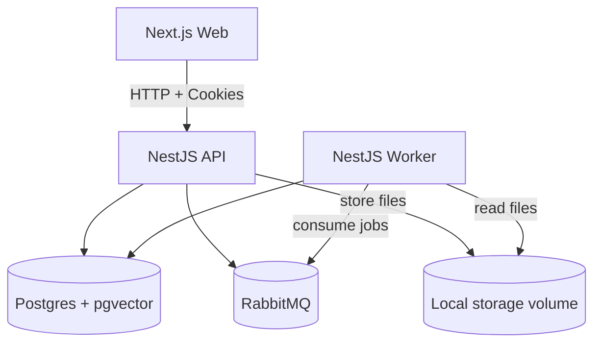

# Architecture

## Key flows

### Document processing

1. User uploads a document via API.
2. API stores file locally and creates `Document` (status `UPLOADED`).
3. API enqueues `PROCESS_DOCUMENT`.
4. Worker extracts text, chunks, generates embeddings, stores `DocumentChunk`, updates status `READY`.

### Chat (RAG)

1. User sends a message.
2. API generates query embedding, retrieves top chunks using pgvector similarity, calls LLM, stores assistant message with sources.

